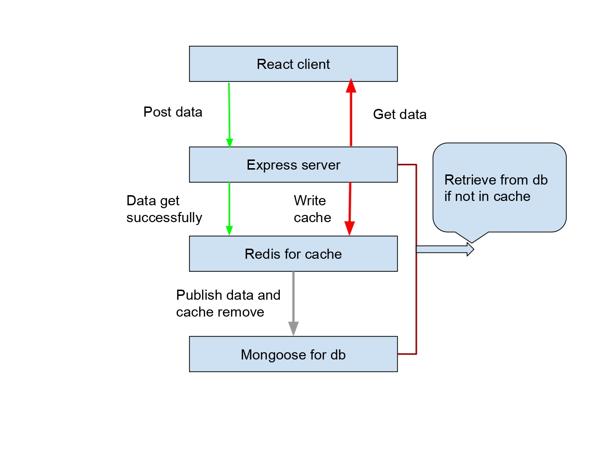

# react-express-redis-docker-architecture
 <h2>Introduction</h2>
<p align=center>
    
               DataFlow
</p>


</br>
Explanation:
</br>
</br>
The react client is the front end of the application and it communicates with the express api server to get and post data to the redis server and the mongo database.

The express api server is the middle layer of the application. When it receives a post request from the react client, it checks the redis cache for the data. If the data is not in the redis cache, it sends a request to the database to get the data and caches the data in the redis cache for future requests. If the data is in the redis cache, it sends the data to the react client. It is also responsible for sending responses to the react client.

Components:
<pre>
 React Client 
 Express Server
 Redis Cache
 Mongo Database
</pre>

Following is a demonstration of the system:

<p align=center>
    
</p>

## Installation
```console
git clone -b master https://github.com/m-h-mridul/react-express-redis-docker-architecture.git
cd react-express-redis-docker-architecture
docker-compose up
```
## to stop
```console
docker-compose down --rmi all -v
```
<h2>Thanks for reading!</h2>
